# 🛠️ Active Directory Home Lab Setup Guide

## 📌 Overview
This guide walks through building a fully functional Active Directory home lab using VirtualBox, Windows Server 2022, and a Windows 10 client.

---

## 🧰 Requirements
- Oracle VirtualBox
- Windows Server 2022 ISO
- Windows 10 ISO
- At least 8GB RAM recommended

---

## 🖥️ Step 1: Create Virtual Machine

- Create new VM (Server22)
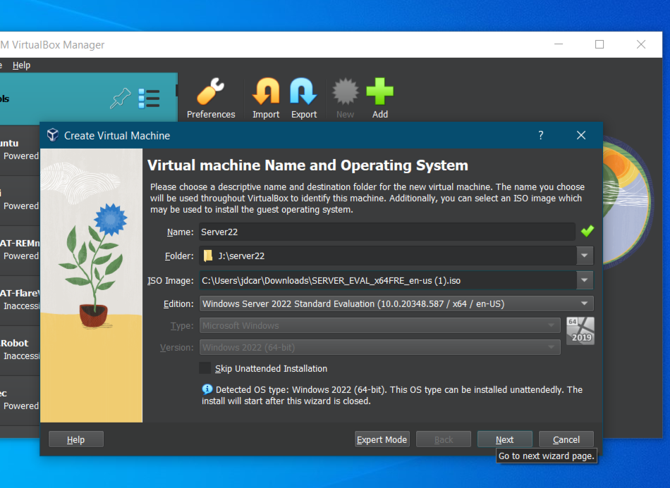

- Allocate system resources (4GB+ RAM recommended)
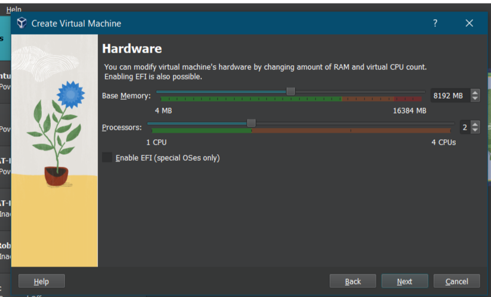

- Set virtual disk size (32GB recommended)
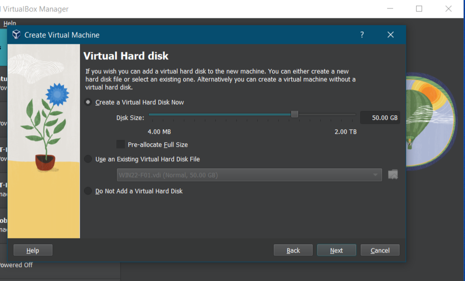

---

## 🌐 Step 2: Configure Networking

- Adapter 1: NAT (internet access)
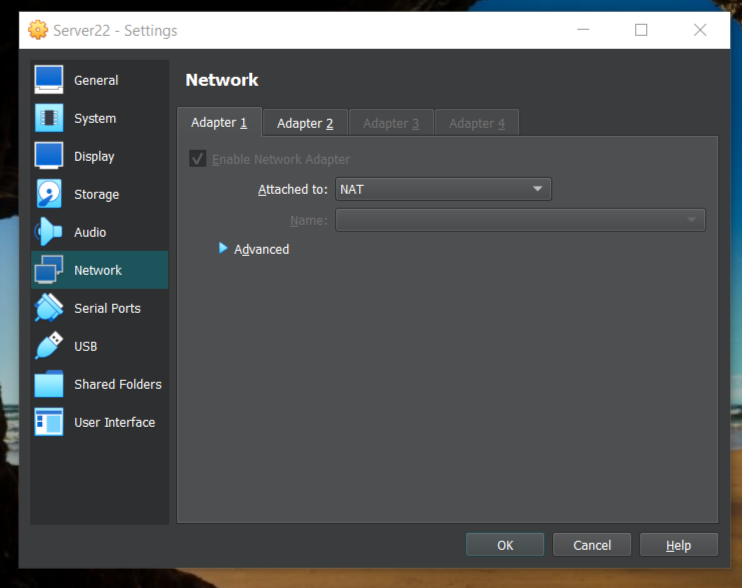

- Adapter 2: Internal Network
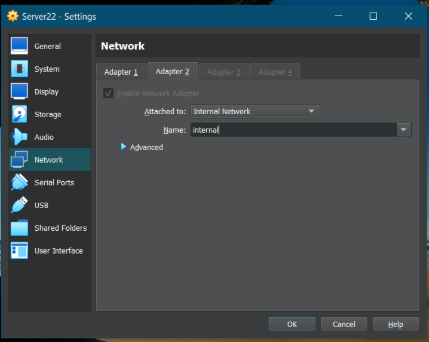

---

## 💻 Step 3: Install Windows Server 2022

- Start installation
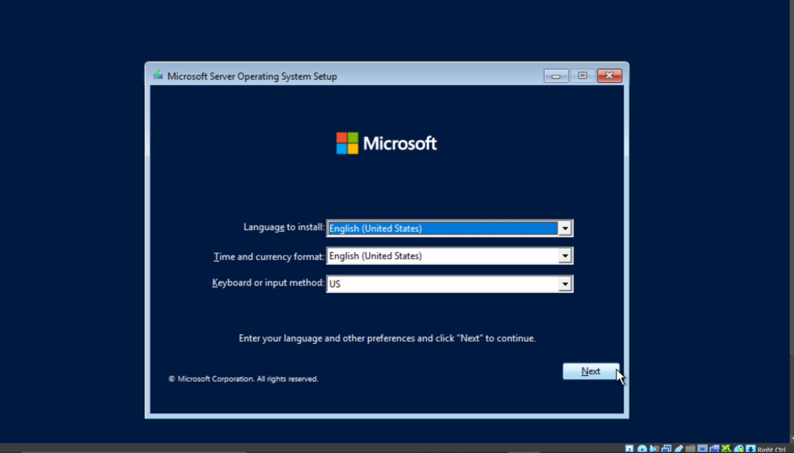

- Select Desktop Experience version
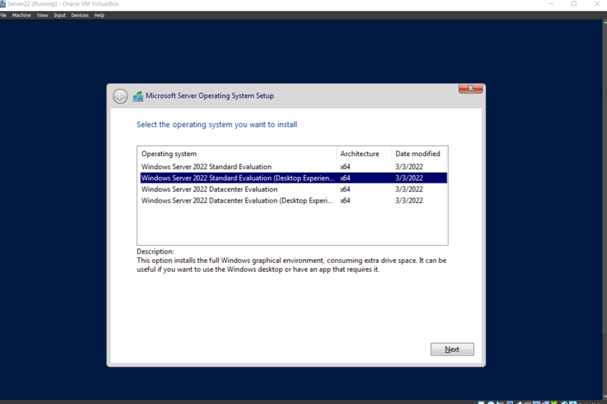

- Set Administrator password
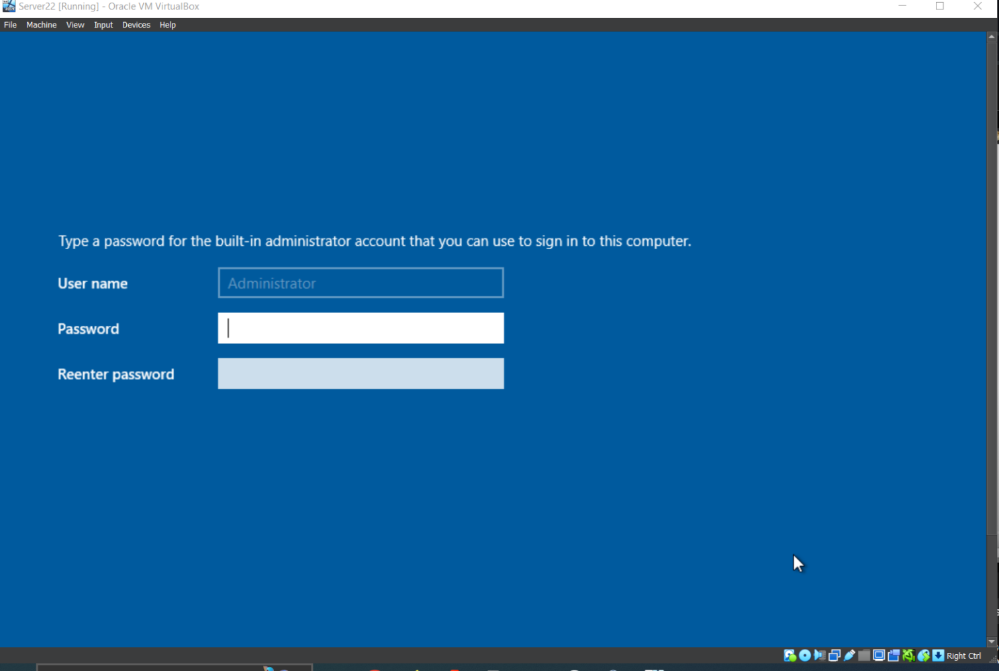

---

## ⚙️ Step 4: Initial Configuration

- Install Guest Additions
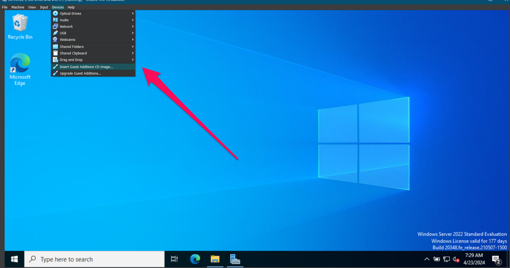

- Configure static IP (172.16.0.1)
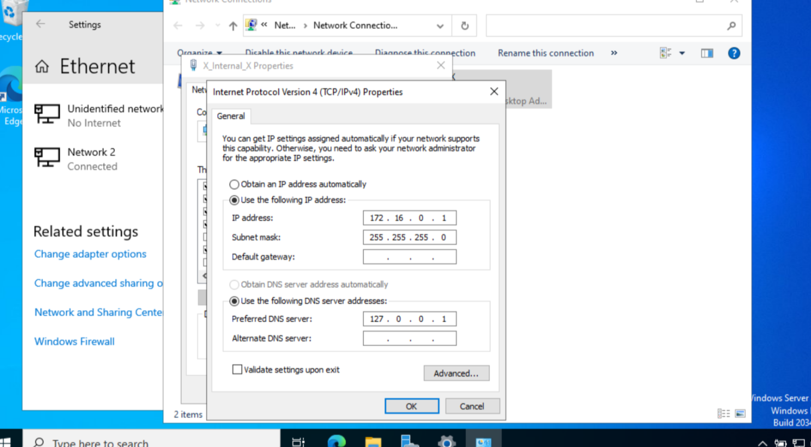

- Rename server to DC
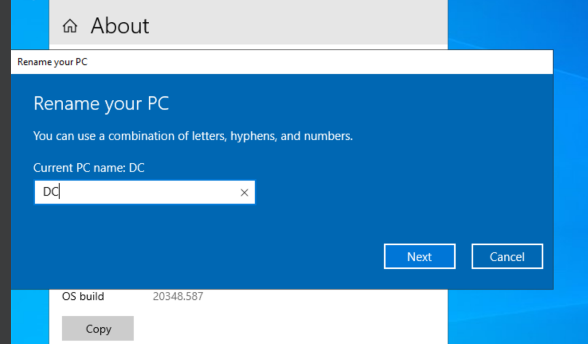

---

## 🏢 Step 5: Install Active Directory

- Add AD DS role
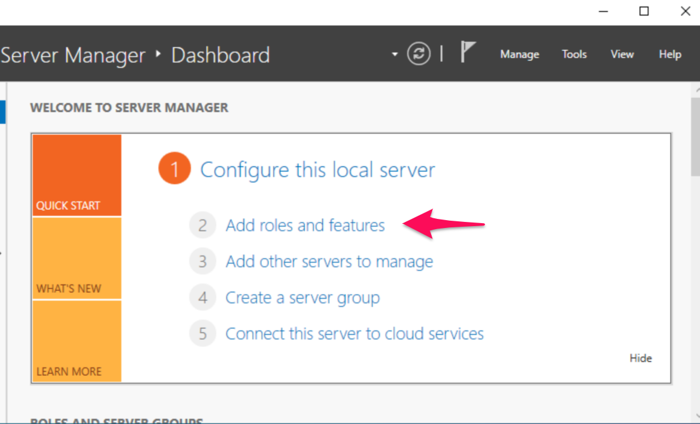

- Promote to Domain Controller (mydomain.com)
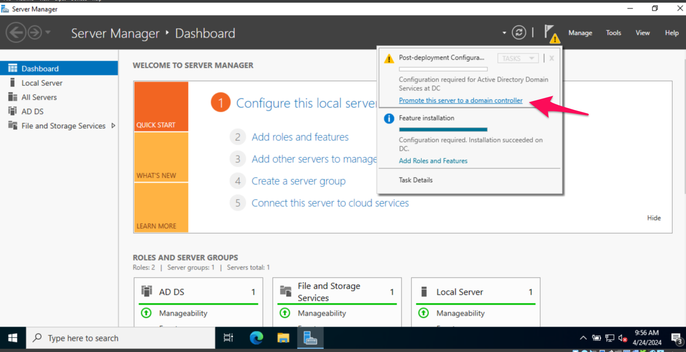

---

## 👤 Step 6: Create Admin User

- Open AD Users & Computers
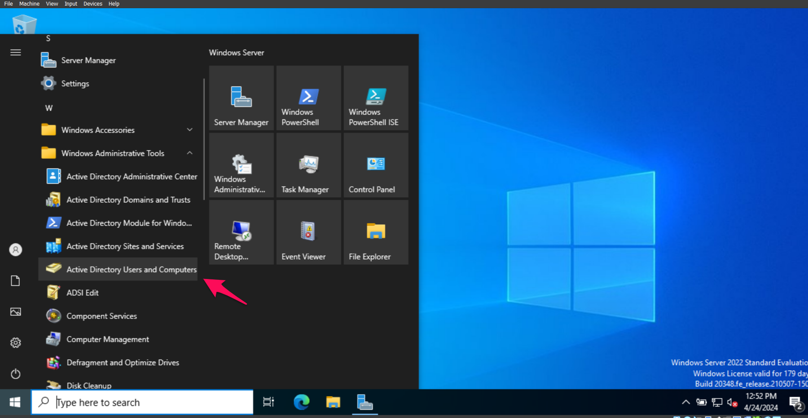

- Create Admin OU and user
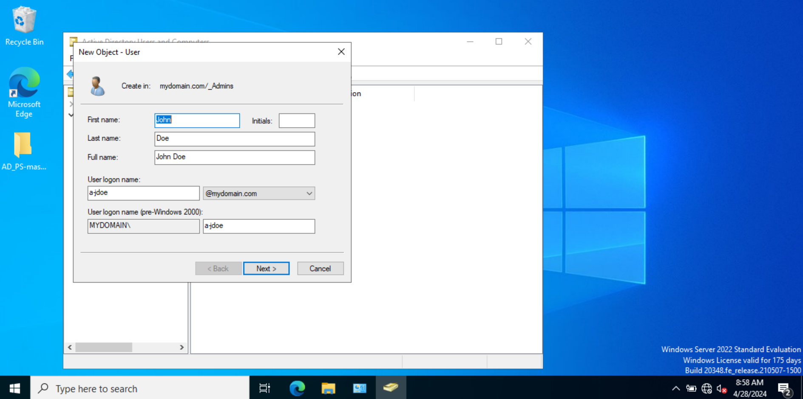

- Add to Domain Admins
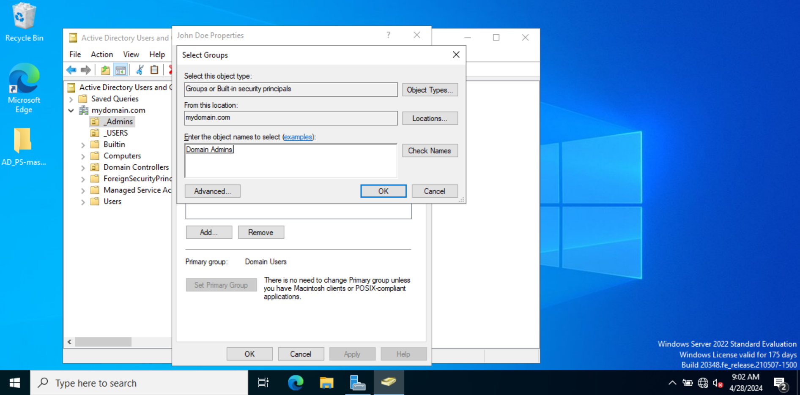

---

## 🌐 Step 7: Configure DHCP

- Install DHCP role
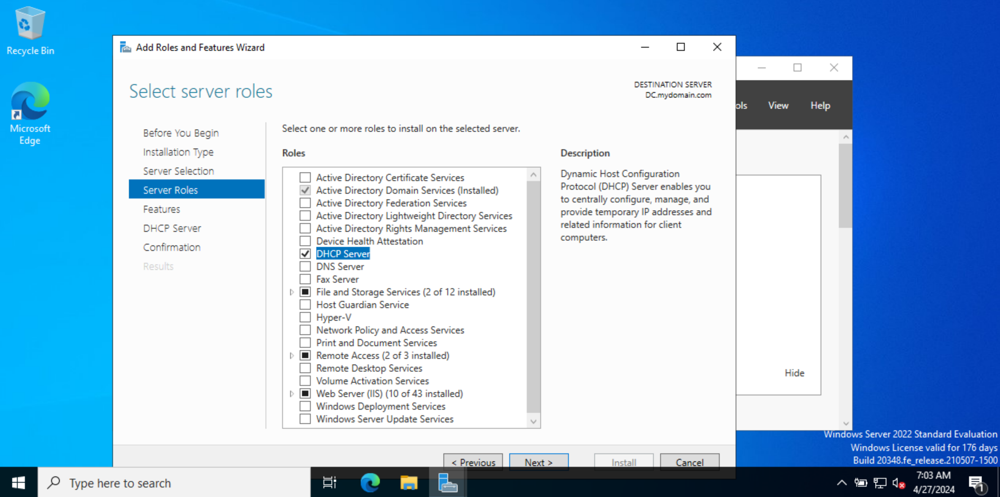

- Create scope (172.16.0.100–200)
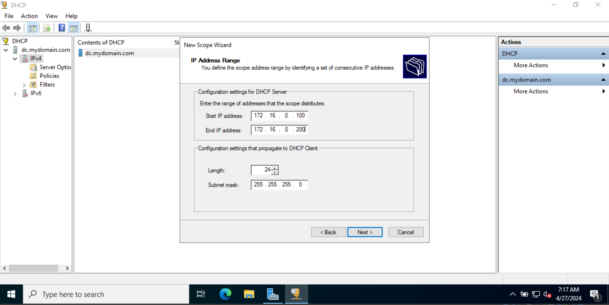

---

## ⚡ Step 8: PowerShell Automation

```powershell
Import-Csv names.txt | ForEach-Object {
    New-ADUser -Name $_.Name -GivenName $_.FirstName -Surname $_.LastName
}
